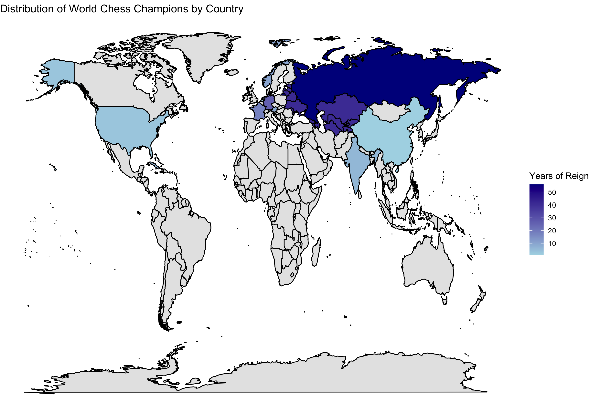

# ♟️ Chess Analysis Project

**Comprehensive Analysis of Chess Games and Player Statistics**

---

## 📖 Overview

This project delves into the intricate world of chess by analyzing game data and player statistics. Utilizing datasets from various sources, it aims to uncover patterns, trends, and insights within the realm of chess.

---

## 📂 Project Structure

The repository comprises the following key components:

- **Datasets** (located in the `datasets` folder):
  - `games.csv`: Contains detailed records of chess games.
  - `worldchampions.csv`: Information on world chess champions.
  - `eco_codes.csv`: Encyclopedia of Chess Openings (ECO) codes.
  - `nations.csv`: Data linking players to their respective countries.
  - `GM_players_statistics.csv`: Statistics of Grandmaster-level players.

- **Script**:
  - `project.R`: R script for data analysis and visualization.

- **Supporting Files**:
  - `Edges.csv` and `Nodes.csv`: These files were used to create a complex node graph in **Gephi**, visualizing which countries had the most significant impact on world chess championships. The graph highlights the relationships between players and their respective countries, illustrating the dominance and influence of nations in the chess world.
---

## 🛠️ Getting Started

To explore and analyze the data:

1. **Clone the Repository**.

2. **Navigate to the Project Directory**.

3. **Follow the instructions in "project.R" script for installing packages**

4. **Run the Analysis Scripts**: 
    Open project.R in your R environment, and execute the code to generate analyses and visualizations.

## 🔍 Analysis Highlights

The project offers insights into:

- **Opening Trends**: Examination of popular chess openings and their success rates based on game outcomes. The analysis includes identifying the most frequently played openings and calculating win rates for white, black, and draw percentages.

- **Player Performance**: Statistical analysis of player performance over time. This includes tracking total games played, wins as white, wins as black, and overall win rates for individual players, providing a comprehensive view of player strengths.

- **World Chess Champions Heatmap**: Analysis of the impact of different countries on world chess championships, visualized through a geographic heatmap. This map highlights the dominance of specific countries in producing world champions, offering insights into the historical influence and contributions of nations in the chess world.

- **Network Graph Analysis**: Visualization of player interactions using complex node graphs generated in Gephi. The network graph illustrates key players and their connections, revealing patterns of rivalries and frequent matchups, as well as the social structure of top-level chess competition.

## 📄 License

This project is licensed under the MIT License. See the [LICENSE](LICENSE) file for details.
